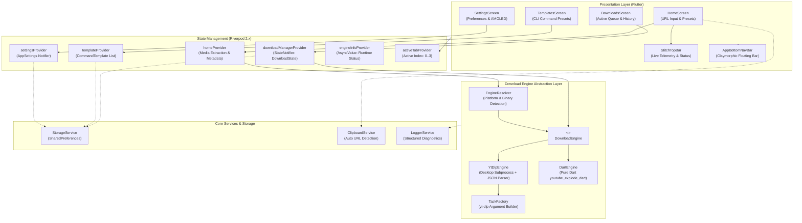

# MediaGrab Architecture Specification

This document provides a comprehensive technical overview of the architecture, design principles, subsystem boundaries, and state flow in **MediaGrab**.

---

## 1. High-Level System Architecture

MediaGrab is engineered as a decoupled, multi-platform media ingestion and archiving client. It combines a reactive UI layer with an abstracted download engine subsystem that delegates tasks to native subprocesses or pure Dart stream extractors depending on platform security models and binary availability.



---

## 2. Directory Structure & Layer Responsibilities

```
lib/
├── app.dart                               # Root MaterialApp configuration & theme binding
├── main.dart                              # Application bootstrap, SharedPreferences & ProviderScope
├── core/                                  # Foundation & Core Infrastructure
│   ├── constants/                         # App-wide string constants, storage keys & version tags
│   │   └── app_constants.dart             # AppConstants (AppName, AppVersion, StorageKeys)
│   ├── errors/                            # Centralized exception models
│   │   ├── app_error.dart                 # AppError domain model & error categorization
│   │   └── logger_service.dart            # Console & disk diagnostic logger
│   ├── l10n/                              # Localization and internationalization
│   │   └── app_localizations.dart         # Translated string dictionaries
│   ├── services/                          # Low-level platform adapters
│   │   ├── clipboard_service.dart         # System clipboard observer for auto-paste
│   │   └── storage_service.dart           # SharedPreferences wrapper with fallback defaults
│   └── theme/                             # Design system & color tokens
│       ├── app_colors.dart                # Cyber-luxe color palette (Slate, Indigo, Sky, Emerald)
│       ├── app_theme.dart                 # Light, Dark, and AMOLED ThemeData builders
│       └── clay_theme.dart                # Dual ambient shadow & rim-highlight claymorphic decorator
├── download_engine/                       # Core Ingestion & Extraction Engine
│   ├── download_engine.dart               # Abstract interface for media download engines
│   ├── dart_engine.dart                   # Pure Dart engine (youtube_explode_dart)
│   ├── ytdlp_engine.dart                  # Subprocess engine with line-by-line JSON progress parsing
│   ├── engine_resolver.dart               # Dynamic runtime engine selector
│   ├── task_factory.dart                  # CLI command sanitizer & flag builder
│   └── models/                            # Engine data transfer objects
│       ├── download_progress.dart         # DownloadProgress model (speed, ETA, bytes, percentage)
│       ├── download_task.dart             # DownloadTask entity with status lifecycle
│       ├── media_info.dart                # Media metadata (title, author, thumbnail, formats)
│       └── stream_option.dart             # Available audio/video resolutions and containers
├── features/                              # Feature-Driven Modules
│   ├── downloads/                         # Download Management Feature
│   │   ├── models/download_record.dart    # Completed download history records
│   │   ├── providers/download_manager.dart# DownloadManager StateNotifier & queue worker
│   │   └── ui/                            # DownloadCard, ActiveQueue, HistoryList, DownloadsScreen
│   ├── home/                              # URL Ingestion & Quick Presets Feature
│   │   ├── providers/home_provider.dart   # URL extraction state notifier
│   │   └── ui/                            # HomeScreen, HeroDownloaderCard, MediaConfigSheet
│   ├── settings/                          # User Preferences & App Diagnostics Feature
│   │   ├── models/app_settings.dart       # Immutable AppSettings configuration model
│   │   ├── providers/settings_provider.dart# Settings notifier with disk sync
│   │   └── ui/settings_screen.dart        # Appearance, aria2c, directory pickers & about
│   ├── splash/                            # Animated Launch Screen Feature
│   │   └── ui/splash_screen.dart          # Radial glow, logo transition & engine initialization
│   └── templates/                         # Custom CLI Command Presets Feature
│       ├── models/command_template.dart   # Custom yt-dlp arguments template model
│       ├── providers/template_provider.dart# Template CRUD notifier with built-in presets
│       └── ui/                            # TemplatesScreen, TemplateEditorDialog
└── shared/                                # Reusable UI Components
    └── widgets/
        ├── adaptive_scaffold.dart         # Responsive navigation shell (Desktop Rail + Mobile Bar)
        ├── animated_pressable.dart        # Tactile scale on tap interaction wrapper
        ├── app_bottom_nav_bar.dart        # Floating claymorphic navbar with backdrop blur
        ├── app_dropdown.dart              # Custom styled popup selection menu
        ├── clay_container.dart            # Standard claymorphic surface container
        ├── quality_chip.dart              # Format/resolution selector pill
        ├── stitch_top_bar.dart            # Sticky cyber-luxe header with telemetry ribbon
        ├── thumbnail_card.dart            # Cached network image card with aspect ratio guard
        ├── top_notification.dart          # Floating toast notification manager
        └── url_input_field.dart           # URL field with auto-paste & clear triggers
```

---

## 3. Download Engine Subsystem

### 3.1 Abstract Engine Interface
The core engine contract (`DownloadEngine`) decouples UI consumption from underlying execution:

```dart
abstract class DownloadEngine {
  Future<MediaInfo> getMediaInfo(String url);
  Stream<DownloadProgress> download({
    required String url,
    required String outputDir,
    required DownloadConfig config,
    String? customArgs,
    CancelToken? cancelToken,
  });
  Future<bool> isAvailable();
  Future<String> getVersion();
}
```

### 3.2 Dual-Engine Strategy

1. **`YtDlpEngine` (Subprocess Execution)**:
   - **Target Platforms**: macOS, Windows, Linux.
   - **Mechanism**: Spawns `yt-dlp` as an asynchronous system process (`Process.start`).
   - **Telemetry**: Employs `--newline` and `--progress-template` to output real-time machine-readable JSON progress into stdout, avoiding brittle regular expression scraping.
   - **Acceleration**: Employs `aria2c` via `--downloader aria2c --downloader-args "aria2c:-x 16 -j 16 -k 1M"` when enabled in settings.

2. **`DartEngine` (Pure Dart)**:
   - **Target Platforms**: iOS, Android, and Desktop fallback.
   - **Mechanism**: Uses `youtube_explode_dart` to query Google's internal player APIs directly, streaming raw chunks to disk using standard Dart `Stream<List<int>>` pipes.
   - **Sandboxing**: Runs without external binary dependencies or JIT compilation, ensuring compliance with strict mobile app store sandboxes.

3. **`EngineResolver`**:
   - Performs environment probing at boot (`which yt-dlp` or `where yt-dlp`).
   - Dynamically resolves to `YtDlpEngine` if the binary is accessible in system `PATH` or bundled directories, or seamlessly falls back to `DartEngine`.

---

## 4. State Management Topology

The application uses **Flutter Riverpod 2.x** with immutable state models:

| Provider | Type | Responsible For |
| :--- | :--- | :--- |
| `downloadManagerProvider` | `StateNotifierProvider<DownloadManager, DownloadState>` | Queue concurrency control, active stream subscriptions, speed calculation, disk history storage. |
| `homeProvider` | `StateNotifierProvider<HomeNotifier, HomeState>` | URL parsing, media extraction state, stream resolution lists, modal configuration sheet. |
| `templateProvider` | `StateNotifierProvider<TemplateNotifier, List<CommandTemplate>>` | User-defined and built-in CLI command presets, JSON import/export. |
| `settingsProvider` | `StateNotifierProvider<SettingsNotifier, AppSettings>` | Theme mode, AMOLED black, download directory, format preferences, aria2c flags. |
| `engineInfoProvider` | `FutureProvider<String>` | Asynchronous host environment inspection, engine version string, thread metrics. |
| `activeTabProvider` | `StateProvider<int>` | Primary navigation shell active index synchronization. |

---

## 5. Design System & Theming Architecture

### 5.1 Cyber-Luxe Color Token Hierarchy
The color system defined in `AppColors` balances deep, distraction-free backgrounds with vibrant high-contrast accents:
- **Base Surfaces**: `slate950` (`#030712`), `slate900` (`#0F172A`), `slate800` (`#1E293B`).
- **Primary Brand**: `brandPrimary` (`#6366F1` Indigo), `brandAccent` (`#8B5CF6` Violet), `brandAccentSoft` (`#A855F7` Purple).
- **Status Signals**: `sky400` (`#38BDF8` Speed), `emerald400` (`#34D399` Success/Online), `amber400` (`#FBBF24` Warning), `rose400` (`#FB7185` Error).

### 5.2 Claymorphism Engine (`ClayTheme`)
Elevated elements utilize soft concave surface styling:
- **Dual Ambient Shadows**: A positive offset dark shadow combined with a negative offset translucent ambient highlight.
- **Rim Light**: A 1.0px semi-transparent perimeter stroke simulating light catching glass bevels.
- **AMOLED Specialization**: Under AMOLED pure black mode, blurred outer shadows are suppressed to eliminate gray halos against `#000000` pixels, replacing them with sharp high-contrast border outlines (`#1E1E1E`).

---

## 6. Security & Sandboxing Constraints

- **CLI Argument Sanitization**: All user-supplied arguments via custom templates undergo strict tokenization and sanitization through `TaskFactory` to prevent command injection vulnerabilities.
- **File System Scoping**: Output directories are verified prior to download initiation. On mobile devices, downloads route through standard system Documents and Downloads directories with scoped storage compatibility.
- **Touch Interception**: The floating bottom navigation bar enforces `HitTestBehavior.opaque` on its gesture listener, preventing accidental activation of background list items through translucent surfaces.
